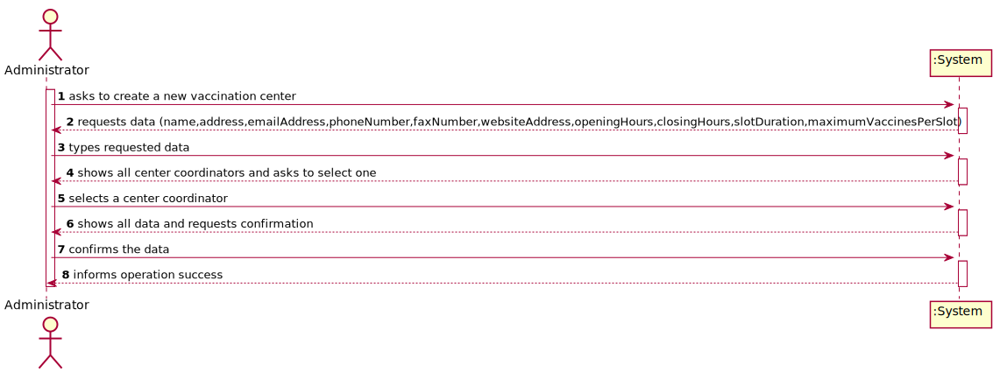

# US 09 - Register a vaccination center  

## 1. Requirements Engineering

### 1.1. User Story Description

_"As an administrator, I want to register a vaccination center to respond to a certain pandemic."_

### 1.2. Customer Specifications and Clarifications 

**From the specifications document:**

>	"[...] vaccination centers are facilities specifically created to administer vaccines of a single type as
response to an ongoing disease outbreak (e.g.: Covid-19)."

>	"[...] vaccination centers are characterized by a name, an address, a phone number, an e-mail address, a
fax number, a website address, opening and closing hours, slot duration (e.g.: 5 minutes) and the
maximum number of vaccines that can be given per slot (e.g.: 10 vaccines per slot)." 

**From the client clarifications:**

> **Question:** Is there any specification about the phone number, fax number, website address, opening and closing hours, slot duration and maximum number of vaccines?
>  
> **Answer:** ?

-

> **Question:** 
>  
> **Answer:** ?

### 1.3. Acceptance Criteria

* **AC1:** __

### 1.4. Found out Dependencies

* No dependencies were found.

### 1.5 Input and Output Data

**Input Data:**

* Typed data:
	* an name;
	* a number;
	* a fax number;
	* website address;
	* opening hours;
	* closing hours;
	* slot duration
	* maximum vaccines per slot. 
	
* Selected data:
	* --

**Output Data:**

* (In)Success of the operation.

### 1.6. System Sequence Diagram (SSD)

**Alternative 1**

**Other alternatives might exist.**

### 1.7 Other Relevant Remarks

* --

## 2. OO Analysis

### 2.1. Relevant Domain Model Excerpt 

### 2.2. Other Remarks

* Not found.

## 3. Design - User Story Realization 

### 3.1. Rationale

**SSD - Alternative 1 is adopted.**

| Interaction ID                                                                                                                           | Question: Which class is responsible for...     | Answer            | Justification (with patterns)                              |
| :--------------------------------------------------------------------------------------------------------------------------------------- | :---------------------------------------------- | :---------------- | :--------------------------------------------------------- |
| Step 1: starts creating a new vaccination center                                                                                         | ... instantiating a new Vaccination center?     | Company           | --                                                         |
| Step 2: request data(name, address, phone number, e-mail address, fax number, website address, slot duration, maximum vaccines per slot) | n/a                                             | n/a               | n/a                                                        |
| Step 3: types requested data                                                                                                             | ... saving the inputted data?                   | VaccinationCenter | IE: object created in step 1 has its own data.             |
| Step 4: shows the data and requests a confirmation                                                                                       | ... validating the data introduced?             | Company           | IE: Task Categories are defined by the Platform.           |
| Step 5: confirms the data                                                                                                                | ... saving the new created Vaccination Center?  | Company           | IE: holds every information about the vaccination process. |
| Step 6: informs operation success                                                                                                        | ... informing that the operation was a success? | UI                | IE: responsible for user interaction.                      |

### Systematization ##

According to the taken rationale, the conceptual classes promoted to software classes are: 

 * Organization
 * Platform
 * Task

Other software classes (i.e. Pure Fabrication) identified: 

 * CreateTaskUI  
 * CreateTaskController

## 3.2. Sequence Diagram (SD)

**Alternative 1**

**Alternative 2**

## 3.3. Class Diagram (CD)

**From alternative 1**

# 4. Tests 

**Test 1:** Check that it is not possible to create an instance of the Task class with null values. 

	@Test(expected = IllegalArgumentException.class)
		public void ensureNullIsNotAllowed() {
		Task instance = new Task(null, null, null, null, null, null, null);
	}
	

**Test 2:** Check that it is not possible to create an instance of the Task class with a reference containing less than five chars - AC2. 

	@Test(expected = IllegalArgumentException.class)
		public void ensureReferenceMeetsAC2() {
		Category cat = new Category(10, "Category 10");
		
		Task instance = new Task("Ab1", "Task Description", "Informal Data", "Technical Data", 3, 3780, cat);
	}

*It is also recommended to organize this content by subsections.* 

# 5. Construction (Implementation)

## Class CreateTaskController 

		public boolean createTask(String ref, String designation, String informalDesc, 
			String technicalDesc, Integer duration, Double cost, Integer catId)() {
		
			Category cat = this.platform.getCategoryById(catId);
			
			Organization org;
			// ... (omitted)
			
			this.task = org.createTask(ref, designation, informalDesc, technicalDesc, duration, cost, cat);
			
			return (this.task != null);
		}

## Class Organization

		public Task createTask(String ref, String designation, String informalDesc, 
			String technicalDesc, Integer duration, Double cost, Category cat)() {
		
	
			Task task = new Task(ref, designation, informalDesc, technicalDesc, duration, cost, cat);
			if (this.validateTask(task))
				return task;
			return null;
		}

# 6. Integration and Demo 

* A new option on the Employee menu options was added.

* Some demo purposes some tasks are bootstrapped while system starts.

# 7. Observations

Platform and Organization classes are getting too many responsibilities due to IE pattern and, therefore, they are becoming huge and harder to maintain. 

Is there any way to avoid this to happen?

