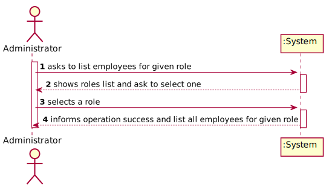
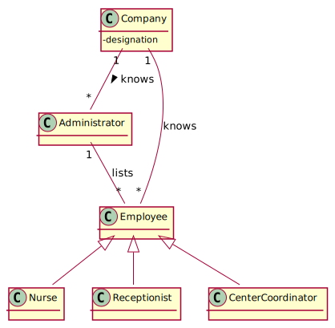
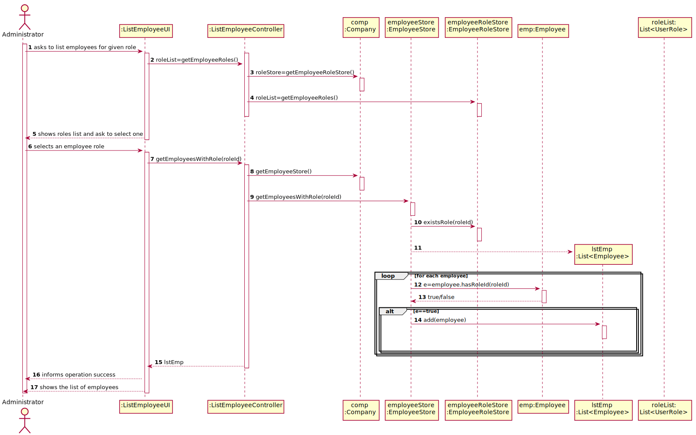
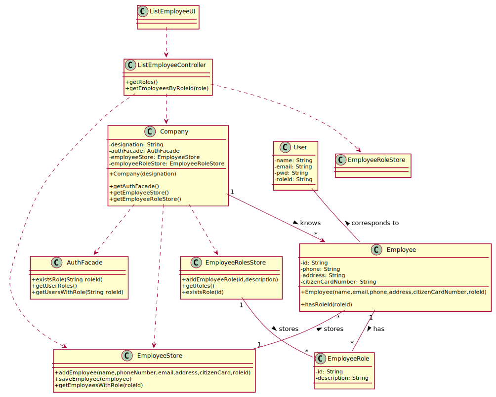

# US 11 - Get Employees List by Role

## 1. Requirements Engineering

### 1.1. User Story Description

_"As an Administrator, I want to get a list of Employees with a given function/role."_

### 1.2. Customer Specifications and Clarifications

**From the specifications document:**

> "[...] receptionists and nurses registered in the application will work in the vaccination process."

> "[...] each vaccination center has one coordinator."

**From the client clarifications:**

> **Question:** ?
>
> **Answer:** ?

### 1.3. Acceptance Criteria

- **ACX:** ?

### 1.4. Found out Dependencies

- There is a dependency to "US10 Register Employee" since at least an employee type must exist to specify the role pretended.

### 1.5 Input and Output Data

**Input Data:**

- Typed data:
  - none
- Selected data:
  - function/role

**Output Data:**

- List of employees for given function/role
- (In)Success of the operation

### 1.6. System Sequence Diagram (SSD)

**Alternative 1**

**Other alternatives might exist.**

### 1.7 Other Relevant Remarks

- Not found.

## 2. OO Analysis

### 2.1. Relevant Domain Model Excerpt

### 2.2. Other Remarks

Not found.

## 3. Design - User Story Realization

### 3.1. Rationale

| Interaction ID                                                  | Question: Which class is responsible for... | Answer  | Justification (with patterns)        |
| :-------------------------------------------------------------- | :------------------------------------------ | :------ | :----------------------------------- |
| Ask to list employees for a given role                          | ... ?                                       | ?       | ?                                    |
| Show roles list and ask to select one                           | ... listing all roles?                      | Company | IE: knows all the existing roles     |
| Select role                                                     | n/a                                         | ?       | ?                                    |
| Shows all data and requests confirmation                        | ... ?                                       | ?       | ?                                    |
| Confirm data                                                    | ... ?                                       | ?       | ?                                    |
| Informs operation success and list all employees for given role | ... informing operation success?            | UI      | IE: responsible for user interaction |

### Systematization

According to the taken rationale, the conceptual classes promoted to software classes are:

- Employee
- Role

Other software classes (i.e. Pure Fabrication) identified:

- ListEmployeeUI
- ListEmployeeController

## 3.2. Sequence Diagram (SD)

**Alternative 1**

**Alternative 2**

## 3.3. Class Diagram (CD)

**From alternative 1**

# 4. Tests

**Test 1:** Check that it is not possible to create an instance of the Task class with null values.

    @Test(expected = IllegalArgumentException.class)
    	public void ensureNullIsNotAllowed() {
    	Task instance = new Task(null, null, null, null, null, null, null);
    }

**Test 2:** Check that it is not possible to create an instance of the Task class with a reference containing less than five chars - AC2.

    @Test(expected = IllegalArgumentException.class)
    	public void ensureReferenceMeetsAC2() {
    	Category cat = new Category(10, "Category 10");

    	Task instance = new Task("Ab1", "Task Description", "Informal Data", "Technical Data", 3, 3780, cat);
    }

_It is also recommended to organize this content by subsections._

# 5. Construction (Implementation)

## Class CreateTaskController

    	public boolean createTask(String ref, String designation, String informalDesc,
    		String technicalDesc, Integer duration, Double cost, Integer catId)() {

    		Category cat = this.platform.getCategoryById(catId);

    		Organization org;
    		// ... (omitted)

    		this.task = org.createTask(ref, designation, informalDesc, technicalDesc, duration, cost, cat);

    		return (this.task != null);
    	}

## Class Organization

    	public Task createTask(String ref, String designation, String informalDesc,
    		String technicalDesc, Integer duration, Double cost, Category cat)() {

    		Task task = new Task(ref, designation, informalDesc, technicalDesc, duration, cost, cat);
    		if (this.validateTask(task))
    			return task;
    		return null;
    	}

# 6. Integration and Demo

- A new option on the Employee menu options was added.

- Some demo purposes some tasks are bootstrapped while system starts.

# 7. Observations

Platform and Organization classes are getting too many responsibilities due to IE pattern and, therefore, they are becoming huge and harder to maintain.

Is there any way to avoid this to happen?
