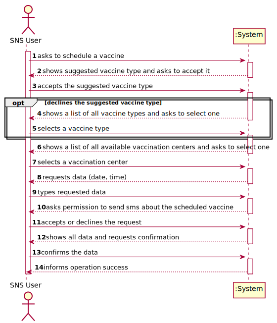
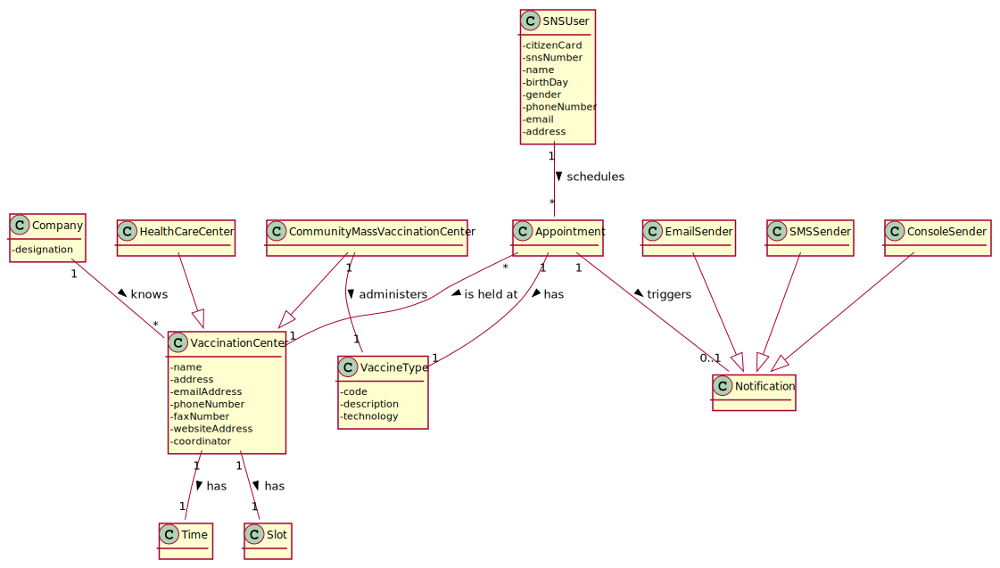
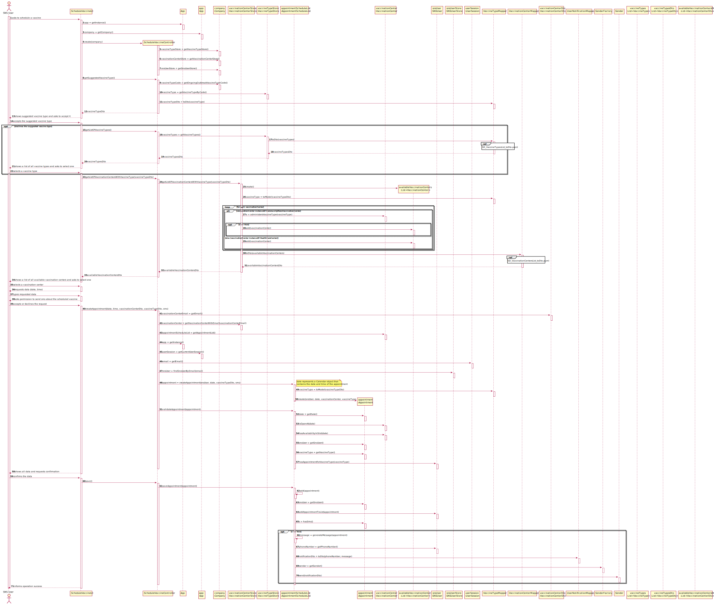
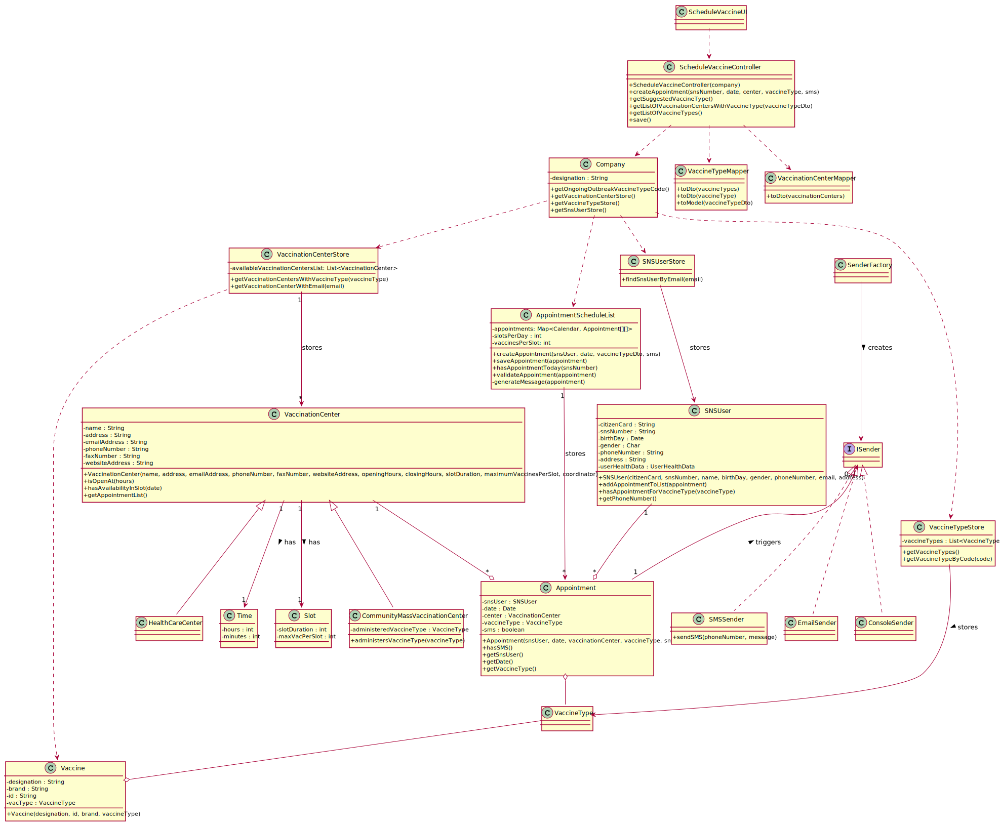

# US 10 - Schedule a Vaccine

## 1. Requirements Engineering

### 1.1. User Story Description

_"As an SNS user, I intend to use the application to schedule a vaccine."_

### 1.2. Customer Specifications and Clarifications 

**From the specifications document:**

>	"To take a vaccine, the SNS user should use the application to schedule his/her vaccination."

>	"The user should introduce his/her SNS user number, select the vaccination center, the date, and the time (s)he wants to be vaccinated as well as the type of vaccine to be administered (by default, the system suggests the one related to the ongoing outbreak)."

>	"Then, the application should check the vaccination center capacity for that day/time and, if possible, confirm that the vaccination is scheduled and inform the user that (s)he should be at the selected vaccination center at the scheduled day and time."

> 	"The SNS user may also authorize the DGS to send an SMS message with information about the scheduled appointment. If the user authorizes the sending of the SMS, the application should send an SMS message when the vaccination event is scheduled and registered in the system."

**From the client clarifications:**

> **Question:** How does the system know which vaccine to suggest when the SNS user is scheduling their vaccine? Is the administrator responsible for setting the outbreak vaccine?
>
> **Answer:** _"The ongoing outbreak should be defined in the system using a configuration file."_

> **Question:** Community mass vaccination centers are facilities created specifically to administer a single type of vaccine as a response to an ongoing disease breakdown. When there is no ongoing outbreak, are this centers out of service or is another type of vaccine selected?
>
> **Answer:** _"These centers are closed when there is no outbreak."_

### 1.3. Acceptance Criteria

* **AC1:** All required fields must be filled in. (SNS user Number, ).
* **AC2:** The SNS user number must have 9 digits.
* **AC3:** A SNS user cannot schedule the same vaccine more than once.
* **AC4:** The algorithm should check if the SNS user is within the age and time since the last vaccine.

### 1.4. Found out Dependencies

* There is a dependency to "US03 - Register an SNS User", because SNS users can only use the application if they are registered in the system.
* There is a dependency to "US09 - Register a Vaccination Center", as the application needs to know which vaccination centers are available.
* There is a dependency to "US12 - Specify a Vaccine Type", as the application needs to know which vaccine types are available, so that SNS users (and receptionists) can schedule a vaccine.
* There is a dependency to "US13 - Specify a Vaccine", because in order to schedule a vaccine, there has to exist, at least, one vaccine registered in the system.

### 1.5 Input and Output Data

**Input Data:**

* Typed data:
	* SNS user number
	* date and time of the vaccination

* Selected data:
	* vaccine type
	* vaccination center

**Output Data:**

* Suggested vaccine type (or the list of all available vaccine types)
* List of all available vaccination centers
* (In)Success of the operation

### 1.6. System Sequence Diagram (SSD)
 
**Alternative 1**

Other alternatives might exist.

### 1.7 Other Relevant Remarks

n/a

## 2. OO Analysis

### 2.1. Relevant Domain Model Excerpt 

### 2.2. Other Remarks

n/a

## 3. Design - User Story Realization 

### 3.1. Rationale

**SSD - Alternative 1 is adopted.**

| Interaction ID                                                                   | Question: Which class is responsible for... | Answer                   | Justification (with patterns)                                                 |
| :------------------------------------------------------------------------------- | :------------------------------------------ | :----------------------- | :---------------------------------------------------------------------------- |
| Step 1: asks to schedule a vaccine                                               | ...instantiate a new Appointment            | AppointmentScheduleList  | Creator: it contains all appointment objects                                  |
| Step 2: shows suggested vaccine type and asks to accept it                       | ...knowing the vaccine type to show?        | Company                  | IE: knows the suggested vaccine type defined in the configuration file        |
| Step 3: accepts the suggested vaccine type                                       | ...saving the vaccine type?                 | Appointment              | IE: object created in step 1 has one vaccine type                             |
| Step 4: shows a list of all vaccine types and asks to select one                 | ...knowing the vaccine types to show?       | VaccineTypeStore         | IE: knows all vaccine types                                                   |
| Step 5: selects a vaccine type                                                   | ...saving the selected vaccine type?        | Appointment              | IE: object created in step 1 has one vaccine type                             |
| Step 6: shows a list of all available vaccination centers and asks to select one | ...knowing the vaccination centers to show? | VaccinationCenterStore   | IE: knows all vaccination centers                                             |
| Step 7: selects a vaccination center                                             | ...saving the selected vaccination center?  | Appointment              | IE: object created in step 1 has one vaccination center                       |
| Step 8: requests data (date, time)                                               | n/a                                         | n/a                      | n/a                                                                           |
| Step 9: types requested data                                                     | ...informing operation success?             | Appointment              | IE: object created in step 1 has date and time                                |
| Step 10: asks permission to send sms about the scheduled vaccine                 | n/a                                         | n/a                      | n/a                                                                           |
| Step 11: accepts or declines the request                                         | ...saving the selected option?              | Appointment              | IE: object created in step 1 has the information about the sending of the sms |
| Step 12: shows all data and requests confirmation                                | ...validating the data introduced?          | AppointmentScheduledList | IE: knows all information needed to validate the appointment                  |
| Step 13: confirms the data                                                       | ...saving the created appointment?          | AppointmentScheduledList | IE: holds all appointment objects                                             |
| Step 14: informs operation success                                               | ...informing operation success?             | ScheduleVaccineUI        | IE: responsible for user interaction                                          |

### Systematization ##

According to the taken rationale, the conceptual classes promoted to software classes are: 

 * Appointment
 * AppointmentScheduleList

Other software classes (i.e. Pure Fabrication) identified: 

 * ScheduleVaccineUI
 * ScheduleVaccineController

## 3.2. Sequence Diagram (SD)

**Alternative 1**

## 3.3. Class Diagram (CD)

**From alternative 1**

# 4. Tests

## Instantiate objects with null values

**Test 1:** Check that it is not possible to create an instance of the Appointment class with null values. 

	@Test(expected = IllegalArgumentException.class)
    public void ensureNullIsNotAllowed() {
        Appointment instance = new Appointment(null, null, null, null, null);
    }

# 5. Construction (Implementation)

## Class ScheduleVaccineController

    public void createAppointment(Date date, String time, VaccinationCenterListDTO centerDto, VaccineTypeDTO vaccineTypeDto, boolean sms) {
        VaccinationCenter center = vaccinationCenterStore.getVaccinationCenterWithEmail(centerDto.getEmail());
        this.appointmentSchedule = center.getAppointmentList();

	    String email = App.getInstance().getCurrentUserSession().getUserId().getEmail();
        SNSUser snsUser = snsUserStore.findSNSUserByEmail(email);

        try {
            Calendar dateAndTime = CalendarUtils.parseDateTime(date, time);

            this.appointment = appointmentSchedule.createAppointment(snsUser, dateAndTime, vaccineTypeDto, sms);
        } catch (ParseException ex) {
            throw new IllegalArgumentException("Date or time invalid.");
        }

        appointmentSchedule.validateAppointment(this.appointment);
  	}

## Class AppointmentScheduleList

    public Appointment createAppointment(SNSUser snsUser, Calendar date, VaccineTypeDTO vaccineTypeDto, boolean sms) {
        VaccineType vaccineType = VaccineTypeMapper.toModel(vaccineTypeDto);

        Appointment appointment = new Appointment(snsUser, date, this.vaccinationCenter, vaccineType, sms);

        return appointment;
    }

# 6. Integration and Demo 

A new option ("Schedule a Vaccine") was added to the SNS user menu.

For demo purposes, there are multiple objects of all classes created in the previous steps being created when the application is bootstrapped.

# 7. Observations

There are validations needed for this US that are not implemented in the system yet. Therefore, those validations are not implemented yet.