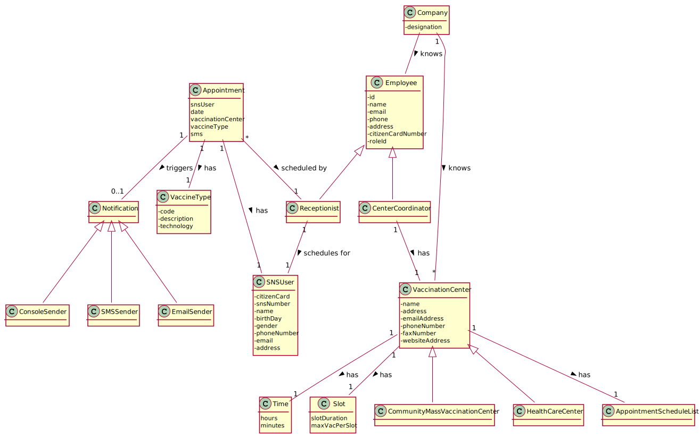
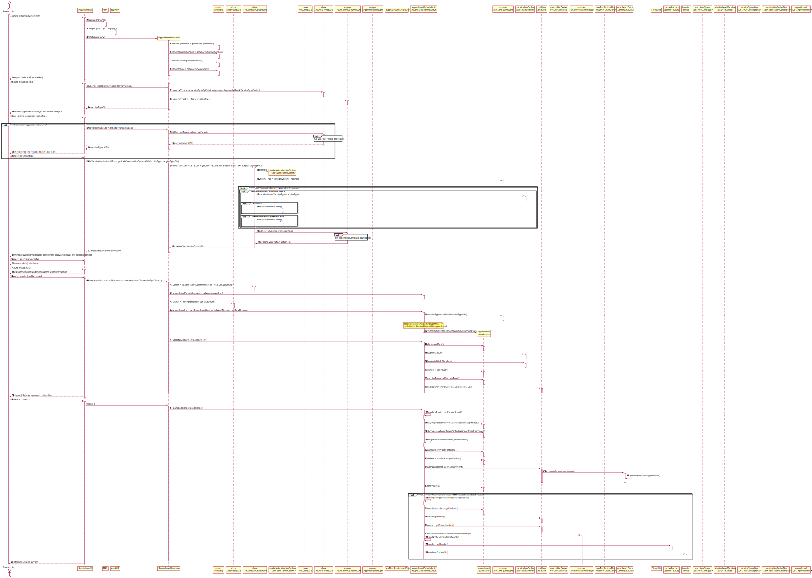

# US 02 - Schedule a vaccination

## 1. Requirements Engineering

### 1.1. User Story Description

_"As a receptionist at one vaccination center, I want to schedule a vaccination."_

### 1.2. Customer Specifications and Clarifications 

**From the specifications document:**

> "Some users (e.g.: older ones) may want to go to a healthcare center to schedule the vaccine appointment with the help of a receptionists at one vaccination center."

> " (...) his/her SNS user number, select the vaccination center, the date, and the time (s)he wants to be vaccinated as well as the type of vaccine to be administered (...)"

> "Then, the application should check the vaccination center capacity for that day/time and, if possible, confirm that the vaccination is scheduled and inform the user that (s)he should be at the selected vaccination center at the scheduled day and time."

> "The SNS user may also authorize the DGS to send an SMS message with information about the scheduled appointment. If the user authorizes the sending of the SMS, the application should send an SMS message when the vaccination event is scheduled and registered in the system."

**From the client clarifications:**

> **Question:** "How does the system know which vaccine to suggest when the SNS user is scheduling their vaccine? Is the administrator responsible for setting the outbreak vaccine?"
>  
> **Answer:** "The ongoing outbreak should be defined in the system using a configuration file."

> **Question:** "A receptionist has the ability to schedule an appointment in different vaccination centres or only on their own?"
>
> **Answer:** "A receptionist (and a user) can schedule a vaccine at any vaccination center."
> 
> **Question:** "When a receptionist schedules a vaccination for an SNS user, should they be presented with a list of available vaccines (brands, that meet acceptance criteria) from which to choose? Or should the application suggest only one?"
>
> **Answer:** "The receptionist do not select the vaccine brand. When the user is at the vaccination center to take the vaccine, the nurse selects the vaccine. In Sprint D we will introduce new USs where the nurse records the administration of a vaccine to a SNS user."

### 1.3. Acceptance Criteria

* **AC1:** All required fields must be filled in.
* **AC2:** The algorithm should check if the SNS User is within the age and time since the last vaccine.
* **AC3:** The SNS User number must have 9 digits.
* **AC4:** A receptionist cannot schedule the same vaccine more than once for the same SNS User.

### 1.4. Found out Dependencies

* There is a dependency to "US03 - Register an SNS User", as the SNS User needs to be registered in the system to be part of an appointment.
* There is a dependency to "US09 - Register a Vaccination Center", as it needs to exist at least one vaccination center registered in the system.
* There is a dependency to "US12 - Specify a Vaccine Type", as the application needs to know which vaccine types are available, so that SNS users and receptionists can schedule a vaccine.
* There is a dependency to "US13 - Specify a Vaccine", because in order to schedule a vaccine, there has to exist, at least, one vaccine registered in the system.

 
### 1.5 Input and Output Data

**Input Data:**

* Typed data:
	* SNS number, 
	* date, 
	* time.
* Selected data:
	* Vaccination centers,
	* Type of vaccine.

**Output Data:**

* List of vaccination centers.
* Suggested vaccine type (or the list of all available vaccine types).
* (In)Success of the operation.

### 1.6. System Sequence Diagram (SSD)

**Alternative 1**

**Other alternatives might exist.**

### 1.7 Other Relevant Remarks

* --

## 2. OO Analysis

### 2.1. Relevant Domain Model Excerpt 

### 2.2. Other Remarks

n/a

## 3. Design - User Story Realization 

### 3.1. Rationale

**SSD - Alternative 1 is adopted.**

| Interaction ID | Question: Which class is responsible for... | Answer                        | Justification (with patterns)                                                                                 |
| :------------- | :------------------------------------------ | :---------------------------- | :------------------------------------------------------------------------------------------------------------ |
| Step 1         | ... interacting with the actor?             | ScheduleVaccineReceptionistUI | Pure Fabrication: there is no reason to assign this responsibility to any existing class in the Domain Model. |
|                | ... coordinating the US?                    | ScheduleVaccineController     | Controller                                                                                                    |
|                | ... instantiating a new Appointment?        | Appointment                   | Creator: R1/2                                                                                                 |
| Step 2         | n/a                                         | n/a                           | n/a                                                                                                           |
| Step 3         | ... validate SNS User Number?               | SNSUserStore                  | IE: object created in step 1 has its own data.                                                                |
| Step 4         | ... knows the suggested vaccine?            | Company                       | IE: knows the ongoing outbreak.                                                                               |
| Step 5         | n/a                                         | n/a                           | n/a                                                                                                           |
| opt Step 6     | ... listing all vaccine types?              | VaccineTypeStore              | IE: knows all the existing vaccine types                                                                      |
| opt Step 7     | n/a                                         | n/a                           | n/a                                                                                                           |
| step 8         | ... listing all vaccination centers?        | VaccinationCenterStore        | IE: knows all the existing vaccination centers                                                                |
| step 9         | ... saving vaccination center?              | Appointment                   | IE:                                                                                                           |
| step 10        | n/a                                         | n/a                           | n/a                                                                                                           |
| step 11        | ... saving date and time?                   | Appointment                   | IE:                                                                                                           |
|                | ... validating center availability?         | VaccinationCenter             | IE: knows vaccination center appointments.                                                                    |
| Step 12        | n/a                                         | n/a                           | n/a                                                                                                           |
| Step 13        | ... send SMS message?                       | SMSSender                     | IE:                                                                                                           |
| Step 14        | ... gets relevant information to the user?  | AppointmentDto                | Dto: knows relevant information.                                                                              |
|                | ... check for duplicates appointment?       | VaccinationCenter             | IE: holds every information about the schedules.                                                              |
| Step 15        | ... saving the new appointment?             | VaccinationCenter             | IE: holds every information about the schedules.                                                              |
| Step 16        | ... informing operation success?            | ScheduleVaccineReceptionistUI | IE: is responsible for user interactions.                                                                     |

### Systematization ##

According to the taken rationale, the conceptual classes promoted to software classes are: 

 * Company
 * Appointment
 * AppointmentScheduleList
 * VaccineTypeStore
 * SNSUserStore
  
Other software classes (i.e. Pure Fabrication) identified: 

 * ScheduleVaccineReceptionistUI  
 * ScheduleVaccineController

## 3.2. Sequence Diagram (SD)

**Alternative 1**

## 3.3. Class Diagram (CD)

**From alternative 1**

# 4. Tests 

**Test 1:** Check that it is not possible to create an instance of the Task class with null values. 

	@Test(expected = IllegalArgumentException.class)
		public void ensureNullIsNotAllowed() {
		Task instance = new Task(null, null, null, null, null, null, null);
	}
	

**Test 2:** Check that it is not possible to create an instance of the Task class with a reference containing less than five chars - AC2. 

	@Test(expected = IllegalArgumentException.class)
		public void ensureReferenceMeetsAC2() {
		Category cat = new Category(10, "Category 10");
		
		Task instance = new Task("Ab1", "Task Description", "Informal Data", "Technical Data", 3, 3780, cat);
	}

*It is also recommended to organize this content by subsections.* 

# 5. Construction (Implementation)

## Class CreateTaskController 

		public boolean createTask(String ref, String designation, String informalDesc, 
			String technicalDesc, Integer duration, Double cost, Integer catId)() {
		
			Category cat = this.platform.getCategoryById(catId);
			
			Organization org;
			// ... (omitted)
			
			this.task = org.createTask(ref, designation, informalDesc, technicalDesc, duration, cost, cat);
			
			return (this.task != null);
		}

## Class Organization

		public Task createTask(String ref, String designation, String informalDesc, 
			String technicalDesc, Integer duration, Double cost, Category cat)() {
		
	
			Task task = new Task(ref, designation, informalDesc, technicalDesc, duration, cost, cat);
			if (this.validateTask(task))
				return task;
			return null;
		}

# 6. Integration and Demo 

* A new option on the Receptionist menu options was added.

# 7. Observations

Platform and Organization classes are getting too many responsibilities due to IE pattern and, therefore, they are becoming huge and harder to maintain. 

Is there any way to avoid this to happen?

