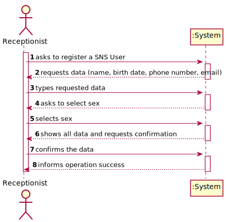
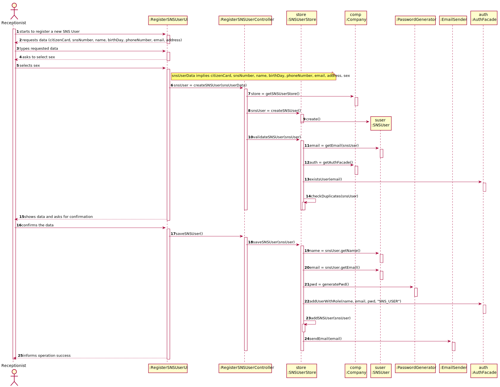
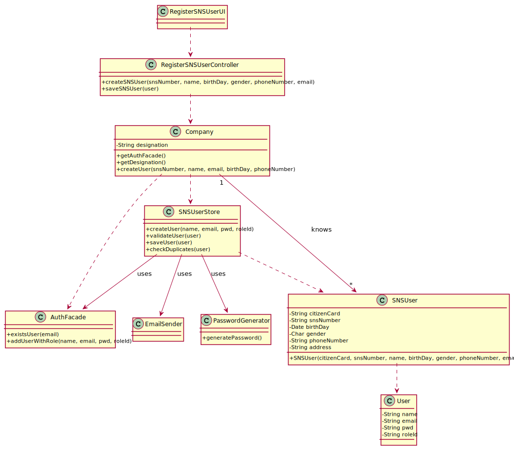

# US 03 - Register a new SNS user

## 1. Requirements Engineering

### 1.1. User Story Description

_"As a receptionist, I want to register a SNS User."_

### 1.2. Customer Specifications and Clarifications

**From the specifications document:**

<!-- > A SNS User is a person who is registered in the system. -->

> A SNS User must have an email, a password, a name, a birthday as well as a SNS number.

> Any Administrator uses the application to register SNS users.

<!-- > When the SNS user arrives at the vaccination center, a receptionist registers the arrival of the user to take the respective vaccine. -->

**From the client clarifications:**

<!-- TODO: update questions - check forum -->

<!-- > **Question:** Accordingly to our project description, the person allowed to register a SNS User is the Administrator. When the receptionist registers a SNS User, does he register the SNS user in the application or his arrival?
>
> **Answer:** —

> **Question:** What information should the receptionist ask the SNS user to insert in the application?
>
> **Answer:** — -->

> **Question:** Regarding US3: "As a receptionist, I want to register an SNS User". What are the necessary components in order to register an SNS User?
>
> **Answer:** The attributes that should be used to describe a SNS user are: Name, Address, Sex, Phone Number, E-mail, Birth Date, SNS User Number and Citizen Card Number.
> The Sex attribute is optional. All other fields are required.
> The E-mail, Phone Number, Citizen Card Number and SNS User Number should be unique for each SNS user.

> **Question:** Can the SNS User change the password? 
>
> **Answer:** No.

> **Question:** Is the password generated automatically, or is it specified by the user operating the system?
>
> **Answer:** The password should be generated automatically.

### 1.3. Acceptance Criteria

<!-- TODO -->

-   **AC01:** All required fields must be filled in.
-   **AC02:** When creating a User with an already existing reference, the system must reject such operation and the user must have the change to modify the typed reference.
-   **AC03:** Birth day must have the format: DD/MM/YYYY. A SNS User should not have more than 150 years of age.
-   **AC04:** Citizen card numbers should follow the portuguese format (8 digits, 1 control digit and 2 chars + 1 digit)
-   **AC05:** SNS number must have 9 digits.
-   **AC06:** Phone numbers should follow the portuguese format ("+351" + 9 digits).
-   **AC07:** Email address must be validated using a regular expression.
-   **AC08:** Sex options: Male/Female.
-   **AC09:** The password should be randomly generated. It should have 7 alphanumeric characters, 3 of them being upper case and 2 of them must be digits.
-   **AC10:** All input fields are required except sex.
-   **AC11:** The email, phone number, citizen card number and SNS User number must be unique for each SNS User.
    <!-- ? QUESTION -->
    <!-- -   **AC10:** The user receives an e-mail informing that the registration was successful and that he can start to use the system. The e-mail includes the user password. All the e-mail messages should be written to a file with the name emailAndSMSMessages.txt. -->
-

### 1.4. Found out Dependencies

-   Receptionists register SNS Users.

### 1.5 Input and Output Data

**Input Data:**

<!-- TODO -->

-   Typed data:
    -   Citizen Card number
    -   SNS number
    -   Name
    -   Birthday
    -   Phone number
    -   Email
    -   Address
-   Selected data:
    -   Sex

**Output Data:**

-   (In)Success of the operation

### 1.6. System Sequence Diagram (SSD)

**Alternative 1**

**Other alternatives might exist.**

### 1.7 Other Relevant Remarks

-   There are similarities between this user story and the US10 regarding the need to generate a password for the user account.

## 2. OO Analysis

### 2.1. Relevant Domain Model Excerpt

### 2.2. Other Remarks

n/a

## 3. Design - User Story Realization

### 3.1. Rationale

**SSD - Alternative 1 is adopted.**

| Interaction ID                               | Question: Which class is responsible for... | Answer                    | Justification (with patterns)                                                                                     |
| :------------------------------------------- | :------------------------------------------ | :------------------------ | :---------------------------------------------------------------------------------------------------------------- |
| Step 1: register SNS User                    | ... registering a new SNS User?             | RegisterSNSUserUI         | **Pure Fabrication:** there is no reason to assign this responsibility to any existing class in the Domain Model. |
|                                              | ... coordinating the US?                    | RegisterSNSUserController | **Controller**                                                                                                    |
|                                              | ... instantiating a new SNS User?           | SNSUserStore              | **Creator (Rule 1)**                                                                                              |
| Step 2: requests data                        | n/a                                         |                           |                                                                                                                   |
| Step 3: types the requested data             | ... saving the inputted data?               | User                      | IE: object created in step 1 has its own data.                                                                    |
| Step 4: shows data and asks for confirmation |                                             | User                      | IE: object created in step 1 has one sex.                                                                      |
| Step 5: confirms the data                    | ... saving the user?                        | SNSUserStore              | IE: owns all users.                                                                                               |
| Step 6: informs operation success            | ... informing operation success?            | RegisterSNSUserUI         | IE: is responsible for user interactions.                                                                         |

### Systematization

According to the taken rationale, the conceptual classes promoted to software classes are:

-   Employee
-   SNSUser

Other software classes (i.e. Pure Fabrication) identified:

-   CreateSNSUserUI
-   CreateSNSUserController
-   **PasswordGenerator**
-   **EmailNotificationSender**

Other software classes of external systems/components:

-   AuthFacade

## 3.2. Sequence Diagram (SD)

**Alternative 1**

## 3.3. Class Diagram (CD)

**From alternative 1**

# 4. Tests

**Test 1:** Check that it is not possible to create an instance of the SNSUser class with null values.

    @Test(expected = IllegalArgumentException.class)
    	public void ensureNullIsNotAllowed() {
    	SNSUser instance = new SNSUser(null, null, null, null, null);
    }

**Test 2:** Check that it is not possible to create an instance of the SNSUser class with an SNS number containing more than 9 digits.

    @Test(expected = IllegalArgumentException.class)
    	public void ensureReferenceMeetsAC2() {
    	Date birthDay = new Date();

    	SNSUser instance = new SNSUser("12345678901", "Nome", "email@example.com", "+351910000000", birthDay);
    }

_It is also recommended to organize this content by subsections._

# 5. Construction (Implementation)

## Class CreateTaskController

    public void create(String citizenCard, String snsNumber, String name, String birthDay, char sex, String phoneNumber, String email, String address) throws IllegalArgumentException, ParseException {
        // create an instance of an SNS User
        this.snsUser = store.createSNSUser(citizenCard, snsNumber, name, birthDay, sex, phoneNumber, email, address);

        // validate the SNS User
        store.validateSNSUser(snsUser);
    }

## Class Organization

    public SNSUser createSNSUser(String citizenCard, String snsNumber, String name, String birthDayStr, char sex, String phoneNumber, String email, String address) throws IllegalArgumentException, ParseException {
        Calendar birthDay;
        birthDay = CalendarUtils.parse(birthDayStr);

        SNSUser snsUser = new SNSUser(citizenCard, snsNumber, name, birthDay, sex, phoneNumber, email, address);

        return snsUser;
    }

# 6. Integration and Demo

-   A new SNS User is created into the system.

# 7. Observations

<!-- TODO -->

There is a relation between Employee and SNSUser because it needs to exist at least one Employee with the Receptionist role to register a SNS User.
