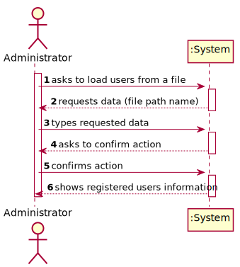
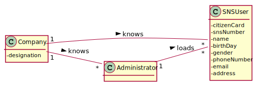
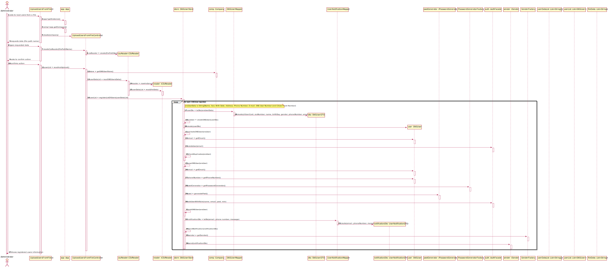
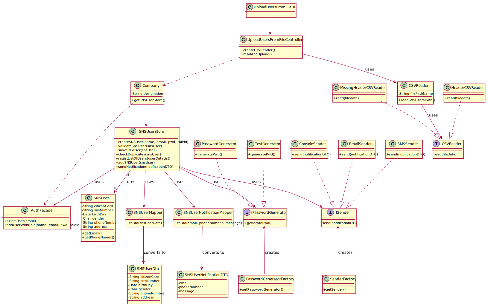

# US 14 - Load users from a file

## 1. Requirements Engineering

### 1.1. User Story Description

As an administrator, I want to load a set of users from a CSV file.

### 1.2. Customer Specifications and Clarifications 

**From the specifications document:**

> A SNS User is a person who is registered in the system.

> A SNS User must have an email, a password, a name, a birthday as well as a SNS number.

> Any Administrator uses the application to register SNS users.

**From the client clarifications:**

> **Question:** What would be the sequence of parameters to be read on the CSV?
>  
> **Answer:** Name, Sex, Birth Date, Address, Phone Number, E-mail, SNS User Number and Citizen Card Number.
>
> **Question:** "is there any specific format that should be validated for the address, or we can assume it is just of string type?"
>
> **Answer:** The address contained in the CSV file is a string and should not contain commas or semicolons.
>
> **Question:** "how should the admin receive the login data/passwords for all registered users?"
>
> **Answer:** During this sprint, login and password data should be presented in the console application.
In US14 the application is used to register a batch of users. For each user, all the data required to register a user should be presented in the console.

### 1.3. Acceptance Criteria

* **AC1:** The application must support importing two types of CSV
files: a) one type must have a header, column separation is done using “;”
character; b) the other type does not have a header, column separation is done
using “,” character. 
* **AC2:** The file path name field must filled in.
* **AC3:** The file path name must correspond to an existing and valid CSV file.
* **AC4:** When loading a User with an already existing reference, the system must reject such operation.
* **AC5:** Birth day must have the format: DD/MM/YYYY. A SNS User should not have more than 150 years of age.
* **AC6:** Citizen card numbers should follow the portuguese format (8 digits, 1 control digit and 2 chars + 1 digit)
* **AC7:** SNS number must have 9 digits.
* **AC8:** Phone numbers should follow the portuguese format ("+351" + 9 digits).
* **AC9:** Email address must be validated using a regular expression.
* **AC10:** Gender options: Male, Female or Not Specified.
* **AC11:** The password should be randomly generated. It should have 7 alphanumeric characters, 3 of them being upper case and 2 of them must be digits.
* **AC12:** All input fields are required except gender.
* **AC13:** The email, phone number, citizen card number and SNS User number must be unique for each SNS User.

### 1.4. Found out Dependencies

* No dependencies were found.

### 1.5 Input and Output Data

**Input Data:**

* Typed data:
	* File path name

**Output Data:**

* Registered Users Information

### 1.6. System Sequence Diagram (SSD)

**Alternative 1**

**Other alternatives might exist.**

### 1.7 Other Relevant Remarks

n/a

## 2. OO Analysis

### 2.1. Relevant Domain Model Excerpt 

### 2.2. Other Remarks

n/a

## 3. Design - User Story Realization 

### 3.1. Rationale

**SSD - Alternative 1 is adopted.**

| Interaction ID | Question: Which class is responsible for... | Answer  | Justification (with patterns)  |
|:-------------  |:--------------------- |:------------|:---------------------------- |
| Step 1  		 |	... interacting with the actor? | UploadUsersFromFileUI   |  Pure Fabrication: there is no reason to assign this responsibility to any existing class in the Domain Model.           |
| 			  	 |	... coordinating the US? | UploadUsersFromFileController | Controller                             |
| Step 2  		 |							 |             |                              |
| Step 3  		 |	...saving the inputted data? | CSVReader  | IE: owns the data.  |
|  		 |	...validate CSV path? | CSVReader  | IE: owns the data.  |
| Step 4  		 |							 |             |                              |
| Step 5  		 |	...read the file? | ICSVReader  | Protected Variation: There are more than 1 variation of file types. |
| 		 |	...store user data? | SNSUserDto  | DTO: stores user data.  |
| 		 |	...convert string of user data to SNSUserDTO? | SNSUserMapper  | IE: can convert user data to DTO.  |  
| 		 |	...instantiating SNSUserDTO? | SNSUserStore  | Creator: SNSUserStore needs a SNSUserDTO to create SNSUser.  |  		 
| 		 |	...instantiating SNSUser? | SNSUserStore  | Creator: SNSUserStore has a SNSUser.  |  		 
|  		 |	...validating SNSUser data?(locally) | SNSUser  | IE: owns the data.  |
|  		 |	...validating SNSUser data?(globally) | SNSUserStore  | IE: knows every SNSUsers registered.  |
| 		 |	...know the method to generate password? | PasswordGeneratorFactory  | Factory: knows the logic to generate password.  |  
| 		 |	...generate password? | IPasswordGenerator  | IE: knows how to generate password.  |  		 
|  		 |	...saving created SNSUser? | SNSUserStore  | IE: owns every SNSUsers.  |
|  		 |	...store the information to notify the user? | SNSUserNotificationDTO  | DTO: store information to notify user.  |
|  		 |	...convert snsUser to notificationDTO? | SNSUserNotificationMapper  | IE: knows relevant data for notificationDTO.  |
|  		 |	...know the method to notify user? | SenderFactory  | Factory: knows the logic to notify user.  |
|  		 |	...notify user? | ISender  | IE: knows how to notify user.  |
|  		 |	...add the user to the system? | authFacade  | IE: owns every Users.  |
|  		 |	...saving the SNS user created? | SNSUserStore  | IE: owns every SNS Users.  |
| Step 6 		 |							 |             |                              |

### Systematization ##

According to the taken rationale, the conceptual classes promoted to software classes are: 

 * Company
 * App
 * SNSUserStore
 * SNSUser
 * CSVReader
 * ICSVReader
 * SNSUserDto
 * SNSUserMapper
 * SNSUserNotificationDTO
 * SNSUserNotificationMapper
 * IPasswordGenerator
 * AuthFacade
 * ISender
 * SenderFactory

Other software classes (i.e. Pure Fabrication) identified: 

 * UploadUsersFromFileUI	  
 * UploadUsersFromFileController

## 3.2. Sequence Diagram (SD)

**Alternative 1**

## 3.3. Class Diagram (CD)

**From alternative 1**

# 4. Tests 

**Test 1:** Check that it is possible to read and upload from a list with a repeated user in the middle of the file.

    @Test
    public void ensureReadAndUploadFromListWhitRepeatedUser() throws ParseException, ClassNotFoundException, InstantiationException, IllegalAccessException, FileNotFoundException {
        int size = store.size();

        ctrl.createCsvReader("src/test/java/app/domain/model/SNSUserFilesToTests/UsersFileWithRepeatedUser.csv");

        ctrl.readAndUpload();

        assertEquals(store.size() - size, 2);
    }
	

**Test 2:** Check that it is possible to read and upload from a list with a invalid user in the middle of the file.

    @Test
    public void ensureReadAndUploadFromListWhitInvalidUser() throws ParseException, ClassNotFoundException, InstantiationException, IllegalAccessException, FileNotFoundException {
        int size = store.size();

        ctrl.createCsvReader("src/test/java/app/domain/model/SNSUserFilesToTests/UsersFileWithInvalidUser.csv");

        ctrl.readAndUpload();

        assertEquals(store.size() - size, 2);
    }

*It is also recommended to organize this content by subsections.* 

# 5. Construction (Implementation)

## Class CSVReader 

		public List<String[]> readSNSUserData() throws ClassNotFoundException, InstantiationException, IllegalAccessException, FileNotFoundException{
			List<String> fileData = FileUtils.readFromFile(this.path);

			
			//checks separator
			String className = fileData.get(0).contains(",") ? "app.service.readCSV.MissingHeaderCSVReader" : "app.service.readCSV.HeaderCSVReader";

			Class<?> oClass = Class.forName(className);

			ICSVReader reader = (ICSVReader) oClass.newInstance();

			List<String[]> userDataList = reader.read(fileData);

			return userDataList;

    	}

## Class SNSUserStore

		public List<SNSUser> registerListOfUsers(List<String[]> userDataList) throws ParseException {
		List<SNSUser> userList = new ArrayList<SNSUser>();

			for (int i = 0; i < userDataList.size(); i++) {
				try{
				SNSUserDTO userDto = SNSUserMapper.toDto(userDataList.get(i));

				SNSUser snsUser = createSNSUser(userDto);
				validateSNSUser(snsUser);
			
				saveSNSUser(snsUser);
			
				userList.add(snsUser);
				}catch(Exception e){
				userList.add(null);
				}
			}
			
			return userList;
		}

# 6. Integration and Demo 

* A new option on the Admin menu options was added.

# 7. Observations

The SNS users registered information output is not perfect, but it will be changed when changing to GUI (Graphical User Interface).

