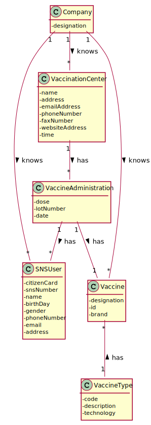

# US 06 - Record Daily Vaccinated

## 1. Requirements Engineering

### 1.1. User Story Description

DGS wants to record daily the total number of people vaccinated in each vaccinated center.

### 1.2. Customer Specifications and Clarifications

**From the specifications document:**

> No Information regarding this US was found on the specifications document.

**From the client clarifications:**

> **Question:** In the acceptance criteria, "the algorithm should run automatically at a time defined in a configuration file and should register a date, the name of the vaccination center and the total number of vaccinated users." How it is supposed to register this information? Should it be recorded in a file (ex: txt,..) or recorded in the system (ex: in a store) ?
>  
> **Answer:** The data should be written to a CSV file (field delimiter should be a semicolon).

### 1.3. Acceptance Criteria

* **AC1** The algorithm should run automatically at a time defined in a configuration file and should register the date, the name of the vaccination center and the total number of vaccinated users.
  
### 1.4. Found out Dependencies

* There is a dependency to US08 - "As a nurse, I want to record the administration of a vaccine to a SNS user. At the end of the recovery period, the user should receive a SMS message informing the SNS user that he can leave the vaccination center.", because in order to record the daily vaccinated people, its needed that the vaccine administration get registered in the system.
  
### 1.5 Input and Output Data

**Output Data:**

- A CSV file is generated

### 1.6. System Sequence Diagram (SSD)

### 1.7 Other Relevant Remarks

## 2. OO Analysis

### 2.1. Relevant Domain Model Excerpt

## 3. Design - User Story Realization

### 3.1. Rationale

| Interaction ID | Question: Which class is responsible for... | Answer | Justification (with patterns) |
| :------------- | :------------------------------------------ | :----- | :---------------------------- |
| Step 1         |                                             |        |                               |

### Systematization

According to the taken rationale, the conceptual classes promoted to software classes are:

- Class1
- Class2
- Class3

Other software classes (i.e. Pure Fabrication) identified:

- xxxxUI
- xxxxController

## 3.2. Sequence Diagram (SD)

_In this section, it is suggested to present an UML dynamic view stating the sequence of domain related software objects' interactions that allows to fulfill the requirement._

## 3.3. Class Diagram (CD)

_In this section, it is suggested to present an UML static view representing the main domain related software classes that are involved in fulfilling the requirement as well as and their relations, attributes and methods._

# 4. Tests

_In this section, it is suggested to systematize how the tests were designed to allow a correct measurement of requirements fulfilling._

**_DO NOT COPY ALL DEVELOPED TESTS HERE_**

**Test 1:** Check that it is not possible to create an instance of the Example class with null values.

    @Test(expected = IllegalArgumentException.class)
    	public void ensureNullIsNotAllowed() {
    	Exemplo instance = new Exemplo(null, null);
    }

_It is also recommended to organize this content by subsections._

# 5. Construction (Implementation)

_In this section, it is suggested to provide, if necessary, some evidence that the construction/implementation is in accordance with the previously carried out design. Furthermore, it is recommeded to mention/describe the existence of other relevant (e.g. configuration) files and highlight relevant commits._

_It is also recommended to organize this content by subsections._

# 6. Integration and Demo

_In this section, it is suggested to describe the efforts made to integrate this functionality with the other features of the system._

# 7. Observations

_In this section, it is suggested to present a critical perspective on the developed work, pointing, for example, to other alternatives and or future related work._
