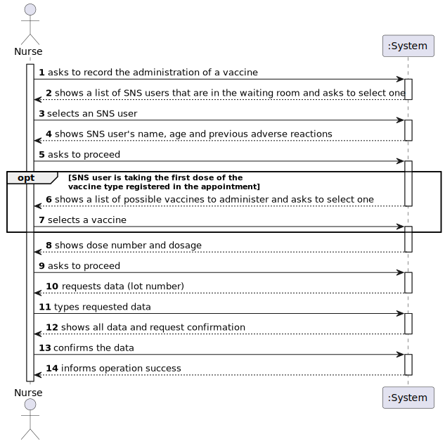
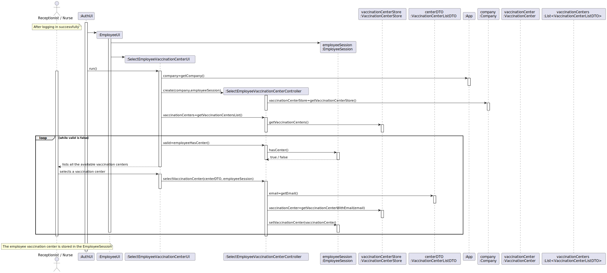
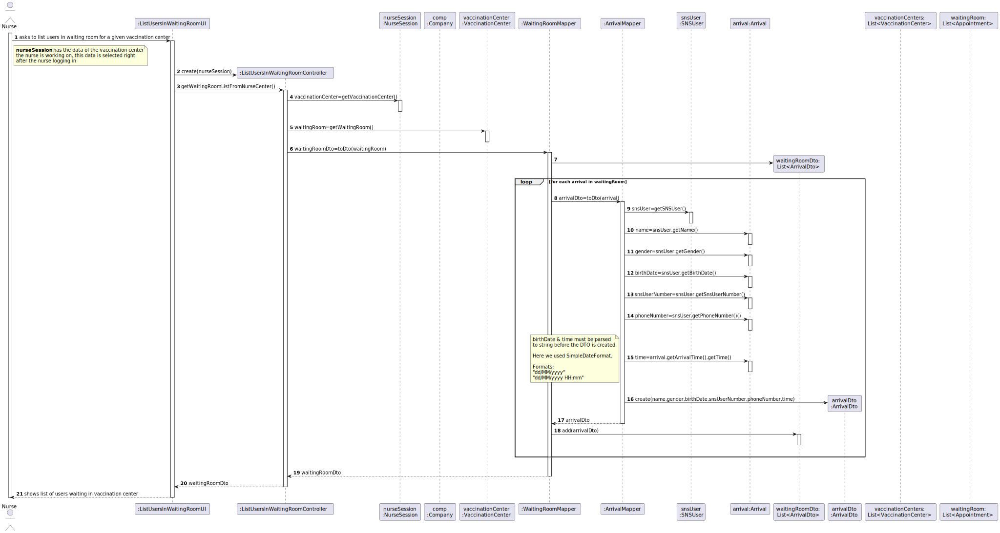
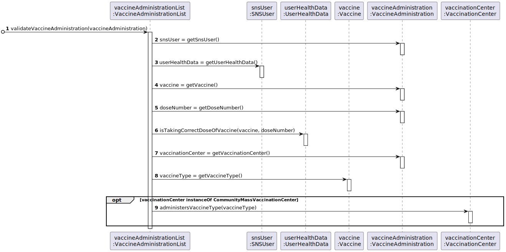
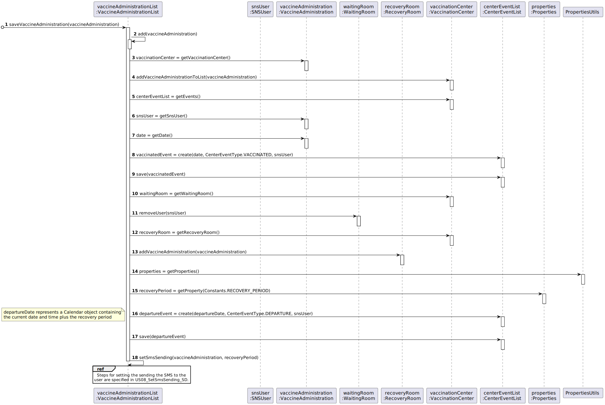
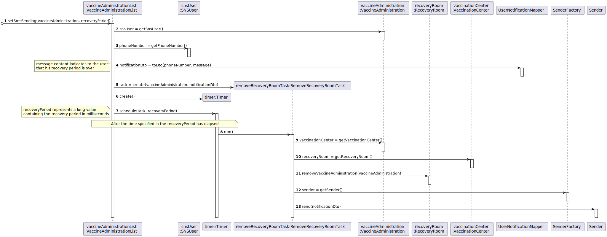
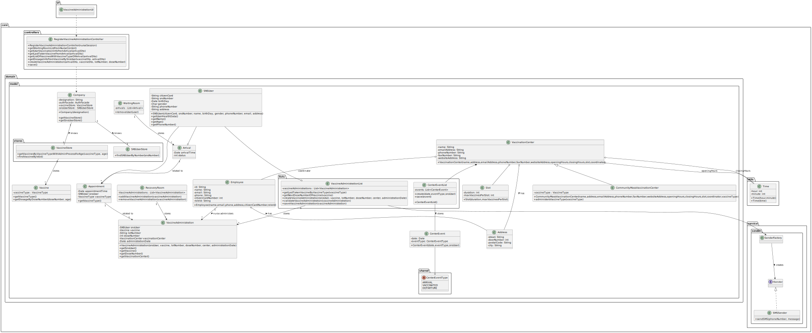

# US 08 - Record the Administration of a Vaccine

## 1. Requirements Engineering

### 1.1. User Story Description

_"As a nurse, I want to record the administration of a vaccine to an SNS user. At the end of the recovery period, the user should receive an SMS message informing the SNS user that he can leave the vaccination center."_

### 1.2. Customer Specifications and Clarifications 

**From the specifications document:**

>	"After giving the vaccine to the user, each nurse registers the event in the system, more precisely, registers the vaccine type (e.g.: Covid-19), vaccine name/brand (e.g.: Astra Zeneca, Moderna, Pfizer), and the lot number used."

>	"Afterwards, the nurse sends the user to a recovery room, to stay there for a given recovery period (e.g.: 30 minutes). If there are no problems, after the given recovery period, the user should leave the vaccination center."

>	"The system should be able to notify (e.g.: SMS or email) the user that his/her recovery period has ended."

**From the client clarifications:**

> **Question:** "To access the user info - scheduled vaccine type and vaccination history -, should the nurse enter user's SNS number?"
>
> **Answer:** _"The nurse should select a SNS user from a list of users that are in the center to take the vaccine."_

> **Question:** "Supposing that the SNS user has already received a dose of a given vaccine type (for example, COVID-19), the user can only receive the same vaccine or a different one with the same vaccine type?"
>
> **Answer:** _"The SNS user can only receive the same vaccine."_

> **Question:** "1: The system displays the list of possible vaccines to be administered (considering the age group of the user); then the nurse selects the dose she is going to administer and gets information about the dosage. But wouldn't it be more correct, since the system knows the vaccination history, in other words, if the user has already taken x dose(s) of that vaccine, to simply show the dose and the respective dosage and not ask for the nurse to arbitrarily select it? 2: After giving the vaccine to the user, how should the nurse register the vaccine type?"
>
> **Answer:** _"1- If it is the first dose, the application should show the list of possible vaccines to be administered. If is not a single dose vaccine, when the SNS user arrives to take the vaccine, the system should simply show the dose and the respective dosage. 2- A vaccine is associated with a given vaccine type. Therefore, there is no need to register the vaccine type. Moreover, the nurse should also register the vaccine lot number (the lot number has five alphanumeric characters, a hyphen, and two numerical characters (example: 21C16-05))"_

> **Question:** "As we can read in Project Description, the vaccination flow follows these steps: 1. Nurse calls one user that is waiting in the waiting room to be vaccinated; 2. Nurse checks the user's health data as well as which vaccine to administer; 3. Nurse administers the vaccine and registers its information in the system. The doubt is: do you want US08 to cover steps 2 and 3, or just step 3?"
>
> **Answer:** _"1. The nurse selects am SNS user from a list. 2. Checks user's Name, Age and Adverse Reactions registered in the system. 3. Registers information about the administered vaccine."_

> **Question:** "Regarding the recovery period, how should we define it? Is it the same for all vaccines or should the nurse specify in each case what the recovery time is?"
>
> **Answer:** _"The recovery period/time is the same for all vaccines. The recovery period/time should be defined in a configuration file."_

> **Question:** "1: Is the nurse responsible for registering in the system the recovery period? 2: If there are no adverse reactions detected/registered, after the given recovery period, the system notifies the user that his/her recovery period has ended, right? 3: If there are adverse reactions detected/registered, the system should not do anything additional?"
>
> **Answer:** _"1- No. The recovery period starts automatically after registering the administration of a given vaccine. 2 and 3- US7 and US 8 are independent user stories."_

> **Question:** "In US 08 says: "At the end of the recovery period, the user should receive an SMS message informing the SNS user that he can leave the vaccination center." How should the SNS user receive and have access to the SMS message?"
>
> **Answer:** _"A file named SMS.txt should be used to receive/record the SMS messages. We will not use a real word service to send SMS's."_

### 1.3. Acceptance Criteria

* **AC1:** If it's the first dose, the nurse should select a vaccine that has the vaccine type of the related appointment, and that has an administration process for the user.

* **AC2:** The nurse should select a user from the waiting room, in order to administer a vaccine.

* **AC3:** The lot number inserted should have five alphanumeric characters, a hyphen, and two numerical characters (example: 21C16-05).

* **AC4:** An SMS should be sent to the user when the recovery period ends, informing him that he can leave the recovery room.

### 1.4. Found out Dependencies

* There is a dependency to "US01 - Schedule a Vaccine", as users need to schedule a vaccine in order to get it administered.
* There is a dependency to "US03 - Register an SNS User", as nurses can only administer a vaccine to users that are registered in the system.
* There is a dependency to "US04 - Register the Arrival of an SNS User", as receptionists need to register arrivals so that SNS Users can get vaccines administered.
* There is a dependency to "US09 - Register a Vaccination Center", as a nurse administers a vaccine in vaccination centers.
* There is a dependency to "US10 - Register an Employee", as nurses have to be registered in the system in order to administrate vaccines.
* There is a dependency to "US12 - Specify a Vaccine Type", because in order to administer vaccines, there has to exist, at least, one vaccine type.
* There is a dependency to "US13 - Specify a Vaccine", because in order to administer vaccines, there has to exist, at least, one vaccine.

### 1.5 Input and Output Data

**Input Data:**

* Typed data:
	* Lot number

* Selected data:
	* SNS User
	* Vaccine (when administering first dose)

**Output Data:**

* List of SNS Users in the waiting room
* Name, age, and previous adverse reactions of the user
* List of vaccines that have the vaccine type of the most recent user arrival
* Dose number and respective dosage of the vaccine that the user is going to receive
* (In)Success of the operation

### 1.6. System Sequence Diagram (SSD)
 
**Alternative 1**

Other alternatives might exist.

### 1.7 Other Relevant Remarks

n/a

## 2. OO Analysis

### 2.1. Relevant Domain Model Excerpt 

### 2.2. Other Remarks

n/a

## 3. Design - User Story Realization 

### 3.1. Rationale

**SSD - Alternative 1 is adopted.**

| Interaction ID                                                                        | Question: Which class is responsible for...   | Answer                    | Justification (with patterns)                                           |
| :------------------------------------------------------------------------------------ | :-------------------------------------------- | :------------------------ | :---------------------------------------------------------------------- |
| Step 1: asks to record the administration of a vaccine                                | ...instantiate a new VaccineAdministration    | VaccineAdministrationList | Creator: it contains all vaccine administration objects                 |
| Step 2: shows a list of SNS users that are in the waiting room and asks to select one | ...knowing the SNS Users to show?             | WaitingRoom               | IE: aggregates all the Arrival objects                                  |
| Step 3: selects an SNS user                                                           | ...saving the selected SNS User?              | VaccineAdministration     | IE: object created in step 1 has one SNS User                           |
| Step 4: shows SNS user's name, age and previous adverse reactions                     | ...knowing all information to show?           | SNSUser / UserHealthData  | IE: knows its own data                                                  |
| Step 5: asks to proceed                                                               | n/a                                           | n/a                       | n/a                                                                     |
| Step 6: shows a list of possible vaccines to administer and asks to select one        | ...knowing the vaccines to show?              | VaccineStore              | IE: knows all vaccines                                                  |
| Step 7: selects a vaccine                                                             | ...saving the selected vaccine?               | VaccineAdministration     | IE: object created in step 1 has one vaccine                            |
| Step 8: shows dose number and dosage                                                  | ...knowing all information to show?           | Vaccine                   | IE: knows its own data                                                  |
| Step 9: asks to proceed                                                               | n/a                                           | n/a                       | n/a                                                                     |
| Step 10: requests data (lot number)                                                   | n/a                                           | n/a                       | n/a                                                                     |
| Step 11: types requested data                                                         | ...saving the lot number?                     | VaccineAdministration     | IE: object created in step 1 has a lot number                           |
| Step 12: shows all data and requests confirmation                                     | ...validating the introduced data?            | VaccineAdministrationList | IE: knows all information needed to validate the vaccine administration |
| Step 13: confirms the data                                                            | ...saving the created vaccine administration? | VaccineAdministrationList | IE: holds all vaccine administration objects                            |
| Step 14: informs operation success                                                    | ...informing operation success?               | VaccineAdministrationUI   | IE: responsible for user interaction                                    |

### Systematization ##

According to the taken rationale, the conceptual classes promoted to software classes are: 

 * VaccineAdministration
 * VaccineAdministrationList
 * WaitingRoom
 * SNSUser
 * UserHealthData
 * Vaccine
 * VaccineStore

Other software classes (i.e. Pure Fabrication) identified: 

 * VaccineAdministrationUI
 * VaccineAdministrationController

## 3.2. Sequence Diagram (SD)

#### Main SD

#### EmployeeLogin SD

#### US05 SD

#### ValidateVaccineAdministration SD

#### SaveVaccineAdministration SD

#### SetSmsSending SD

## 3.3. Class Diagram (CD)

**From alternative 1**

# 4. Tests

## Instantiate objects with null values

**Test 1:** Check that it is not possible to create an instance of the Vaccine Administration class with null values. 

	@Test(expected = IllegalArgumentException.class)
    public void ensureNullIsNotAllowed() {
        new VaccineAdministration(null, null, null, 0, null, null);
    }

## Instantiate objects with invalid Lot Number (AC3)

**Test 2:** Check that it is not possible to create an instance of the Vaccine Administration class with an invalid lot number. 

    @Test(expected = IllegalArgumentException.class)
    public void ensureInvalidLotNumberIsNotAllowed() {
        new VaccineAdministration(user1, vaccine, "aaaaa", 1, vaccinationCenter, Calendar.getInstance());
    }

# 5. Construction (Implementation)

## Class RegisterVaccineAdministration

    public void createVaccineAdministration(ArrivalDTO arrivalDTO,
        VaccineDTO vaccineDTO, String lotNumber, int doseNumber) {
        vaccineAdministrationList =
            getVaccineAdministrationListFromArrival(arrivalDTO);

        String id = vaccineDTO.getId();

        Vaccine vaccine = vaccineStore.findVaccineById(id);

        VaccinationCenter vaccinationCenter = nurseSession.getVaccinationCenter();

        Calendar date = Calendar.getInstance();

        vaccineAdministration =
            vaccineAdministrationList.createVaccineAdministration(snsUser, vaccine,
                lotNumber, doseNumber, vaccinationCenter, date);

        vaccineAdministrationList
            .validateVaccineAdministration(vaccineAdministration);
    }

## Class VaccineAdministrationList

    public VaccineAdministration createVaccineAdministration(SNSUser snsUser, Vaccine vaccine, String lotNumber, int doseNumber,
        VaccinationCenter vaccinationCenter, Calendar date) {
        VaccineAdministration vaccineAdministration = new VaccineAdministration(snsUser, vaccine, lotNumber, doseNumber, vaccinationCenter, date);

        return vaccineAdministration;
    }

# 6. Integration and Demo 

A new option ("Register Vaccine Administration") was added to the Nurse menu.

For demo purposes, there are multiple objects of all classes created in the previous steps being created when the application is bootstrapped.

# 7. Observations

n/a
